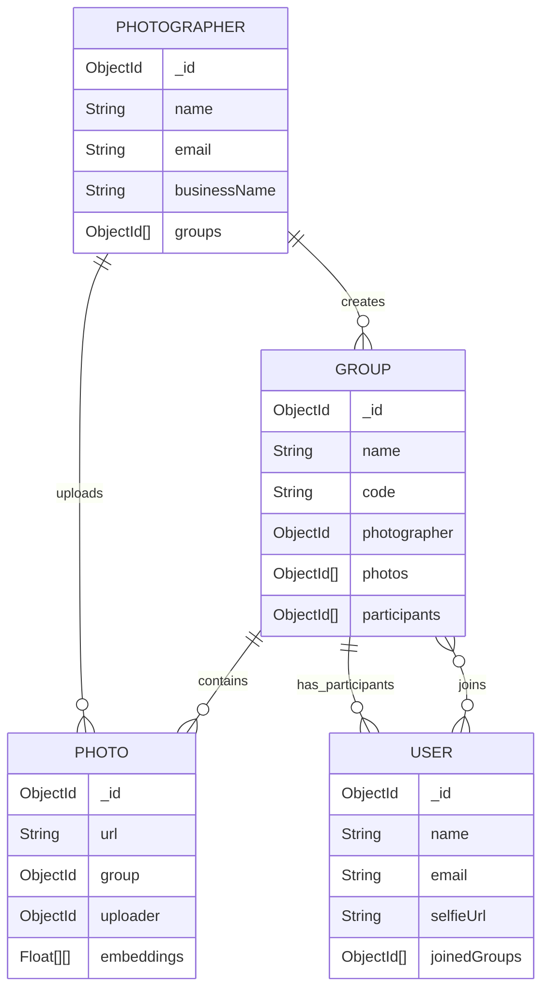

# Data Models (DATA.md)

This file documents the MongoDB data models (Mongoose Schemas) used in the KwikPic project. It is intended to help AI and developers understand the database structure, relationships, and field definitions.

---

## 1. Overview

The database consists of 4 main collections:
1.  **Photographers**: The admin users who create events and upload photos.
2.  **Users (Clients)**: The guests who join events to find their photos.
3.  **Groups**: Represents an Event (e.g., "Wedding"). Links Photographers to Photos and Participants.
4.  **Photos**: The actual images uploaded to an event.

---

## 2. Models & Schemas

### 📸 Photographer (`Photographer.js`)
**Description**: Represents the professional photographer or event organizer.

| Field | Type | Required | Unique | Description |
| :--- | :--- | :--- | :--- | :--- |
| `_id` | ObjectId | Yes | Yes | Auto-generated ID. |
| `name` | String | Yes | No | Full name of the photographer. |
| `email` | String | Yes | Yes | Login email address. |
| `passwordHash` | String | Yes | No | Hashed password (bcrypt). |
| `businessName` | String | Yes | No | Name of their photography business. |
| `avatarUrl` | String | No | No | URL to profile picture. |
| `groups` | [ObjectId] | No | No | Array of references to **Group** model. |
| `createdAt` | Date | - | - | Auto-generated timestamp. |
| `updatedAt` | Date | - | - | Auto-generated timestamp. |

**Relationships**:
-   **One-to-Many**: A Photographer can own multiple `Groups`.

---

### 👥 User / Client (`User.js`)
**Description**: Represents a guest or client who joins an event to find their photos.

| Field | Type | Required | Unique | Description |
| :--- | :--- | :--- | :--- | :--- |
| `_id` | ObjectId | Yes | Yes | Auto-generated ID. |
| `name` | String | Yes | Yes | Username/Display name. |
| `email` | String | Yes | No | Email address (used for OTP/Login). |
| `password` | String | Yes | No | Hashed password. |
| `selfieUrl` | String | No | No | URL of the uploaded selfie (used for face matching). |
| `joinedGroups` | [ObjectId] | No | No | Array of references to **Group** model. |

**Relationships**:
-   **Many-to-Many**: A User can join multiple `Groups`.

---

### 📂 Group (`Group.js`)
**Description**: Represents an Event (e.g., "Summer Party", "John's Wedding"). This is the central hub connecting photos, photographer, and clients.

| Field | Type | Required | Unique | Description |
| :--- | :--- | :--- | :--- | :--- |
| `_id` | ObjectId | Yes | Yes | Auto-generated ID. |
| `name` | String | No | No | Name of the event. |
| `code` | String | Yes | Yes | **Unique 6-digit code** used by clients to join. |
| `photographer` | ObjectId | No | No | Reference to the **Photographer** who created it. |
| `photos` | [ObjectId] | No | No | Array of references to **Photo** model. |
| `participants` | [ObjectId] | No | No | Array of references to **User** model (clients who joined). |
| `createdAt` | Date | - | - | Default: `Date.now`. |

**Relationships**:
-   **Belongs To**: A `Photographer`.
-   **Has Many**: `Photos`.
-   **Has Many**: `Participants` (Users).

---

### 🖼️ Photo (`Photo.js`)
**Description**: Represents a single uploaded image.

| Field | Type | Required | Unique | Description |
| :--- | :--- | :--- | :--- | :--- |
| `_id` | ObjectId | Yes | Yes | Auto-generated ID. |
| `url` | String | Yes | No | Public URL of the image (Cloudinary). |
| `publicId` | String | No | No | Cloudinary Public ID (for management). |
| `filename` | String | No | No | Original filename. |
| `group` | ObjectId | No | No | Reference to the **Group** it belongs to. |
| `uploader` | ObjectId | No | No | Reference to the **Photographer**. |
| `embeddings` | [[Number]] | No | No | **Core AI Field**. An array of arrays, where each inner array is a 512-float vector representing a face found in the photo. |
| `createdAt` | Date | - | - | Default: `Date.now`. |

**Relationships**:
-   **Belongs To**: A `Group`.
-   **Belongs To**: A `Photographer` (Uploader).

---

## 3. Entity Relationship Diagram (ERD)

---

## 4. Key Data Flow Logic

1.  **Face Matching**:
    -   When a **User** uploads a selfie, the Face Service computes a 512-float vector (embedding).
    -   The system queries the **Photo** collection for photos in the specific **Group**.
    -   It compares the User's selfie embedding against every embedding in the `Photo.embeddings` array using **Cosine Similarity**.
    -   Matches > Threshold (e.g., 0.5) are returned to the user.

2.  **Group Joining**:
    -   Users enter a 6-digit `code`.
    -   Backend searches `Group` by `code`.
    -   If found, the User's ID is added to `Group.participants` and the Group ID is added to `User.joinedGroups`.

---
